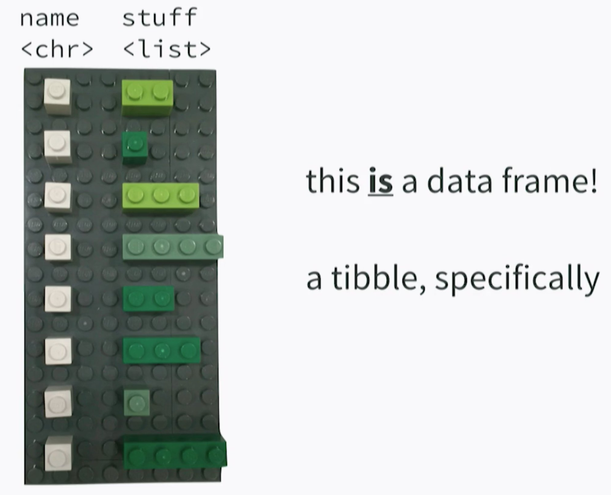

# What is rstudio::conf?

## rstudio::conf  

### **History**  
* Started in 2017 (Orlando)  
* 2nd meeting was held in San Diego, CA in January 2018  
* 2019 meeting – Austin, TX (Jan 15-18, 2019)  

### **Agenda**  
* 2 days of workshops  
* 2 days of conference  

## Workshops
**Vary from beginner to advance**  

* Shiny  
* RMarkdown  
* Deep Learning  
* Tidyverse  
* Train-the-trainer certifications  

<!-- \begin{center} -->
<!-- \includegraphics[width=0.7\textwidth]{Woman_package.png} -->
<!-- \end{center} -->

# Tidyverse  
## Non-Standard Evaluation  
*Hadley Wickham (@hadleywickham)*  

### **NSE examples**
* `df$x` is NSE of ``$`(df, x)`  
* Columns not quoted when called in `ggplot` aesthetics  

### **Bang Bang (`!!`)**
* Indicates an object rather than a column  
* Solves the issue of having object and variable (e.g. column) with the same name   + If you want variable use !!x  
  + If you want column use x  

### **More info**
* Book: Advanced R (2nd edition) - http://adv-r.had.co.nz/

## List Columns  
*Jenny Bryan (@JennyBryan)*  

## List Columns  
*Jenny Bryan (@JennyBryan)*  

### **List columns in a data.frame**  
* "Rectangling" for increased efficiency and handling complicated data in a data.frame  
* `prrr::map_*(glue::glue_data()) %>% unnest()` replaces `lapply()`  

### **Examples** 
* Plotting models: add column to table with linear model (`lm`) results; add to `ggplot` using `group_by()`  
* Example datasets: `repurrrsive` package  

### **More info**   
* [rstd.io/rectangling](rstd.io/rectangling)  

## Tips & Tricks  
*Emily Robinson (@robinson_es)*  

### **Checking data**  
  * Replace values with NA: `dplyr::na_if()`  
  * Examine numeric columns quickly: `dplyr::select_if()`; `skimr::skim()`  
  * Examine single column: `stringr::str_split() %>% tidyr::unnest()`  
  
### **Visualizing data**   
  * Match axes: `forcats::fct_reorder()`  
  * Reorder axis levels: `forcats::fct_relevel()`  

# Visualization Tools    
## Visual Inference   
*Di Cook (@visnut)*    

### **Rationale**    
* *Apophenia* - imagining things in plots  
* Using `ggplot` to see if data is significant   

### **Methods/protocols** 
  1. Rorshach: plot null *before* actual  
  2. Line-up: plot null with actual; *blinded* people pick best  
  
### **Steps with `nullabor` package**  
  1. Create null using permutation or simulation
  2. Get p-value for "line-up"  
  3. Visual inference with `pvisual()`  
  4. Power with `visual_power()`  

## Useful Packages   
* `naniar`: finding and handling NAs  
* `visdat`: visualize dataset  
* `workflowr`: project management (dir structure, git, Rmd, Github page)  
* `ggraphs`: `ggplot` for network data (hierarchical clustering, dendrograms, phylograms, gene networks…)  

# Other 
## TensorFlow  
*JJ Allaire (@fly_upside_down)*  

### Machine/deep learning with `TensorFlow` and `Keras` API  

### **Steps**  
  1. Data pre-processing  
  2. Define model  
  3. Compile model  
  4. Train model  
  5. Evaluate with new data  
  6. Predict, optimize with `tfruns` package    

### **More info**
  * Examples: [tensorflow.rstudio.com/gallery](tensorflow.rstudio.com/gallery)  
  * Book: **Deep learning with R**  

## RStudio 1.1  
*Kevin Ushey (@kevin_ushey)*  

### **Terminal**  
  * You can open bash scripts (`*.sh`) in RStudio
  * Run bash scripts in terminal: `CTRL`+`ALT`+`ENTER` (line-by-line)  
  * `ssh` using terminal  
  * Pass R code to ssh’d connection  
  
### **Connections tab & databases**  
  * View tables in database  
  * `odbc` package  
  * See: [db.rstudio.com](db.rstudio.com)  

##    
> \textbf{\huge\color{rladiespurple}{{Thank you!}}}  

>  

**You can watch all of the talks (2017, 2018) online:**   

[https://www.rstudio.com/resources/videos/rstudioconf-2018-talks](https://www.rstudio.com/resources/videos/rstudioconf-2018-talks)  

>  

